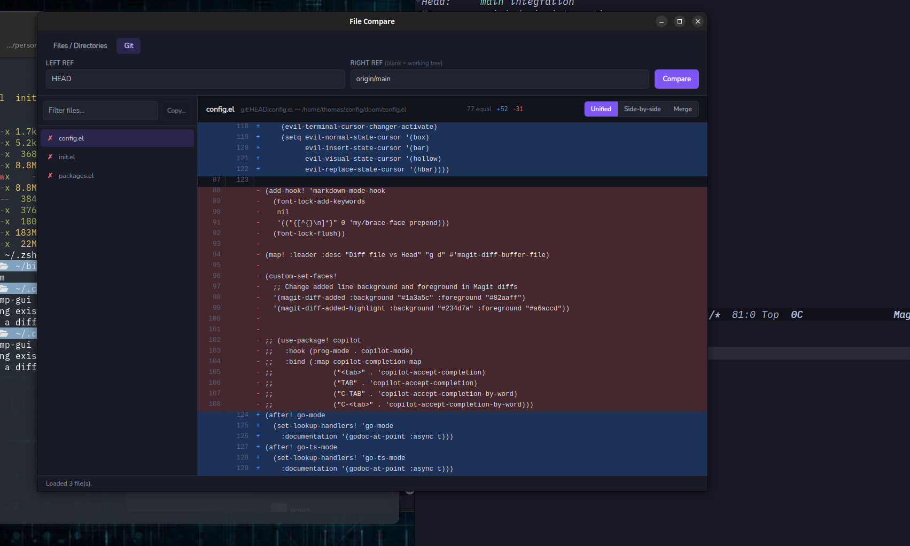

# File Compare

**Compare files, directories, and git refs — then merge just the changes you want. Also I wrote it to be easier for red/green colour blind people to use because I'm tired of all diff tools using at least by default red/green.**

File Compare is a fast, color-coded diff and merge tool written in Go that is clean looking and simple to use. It ships two ways from one engine: a **native desktop app** (Wails) and a **keyboard-driven terminal UI** (Bubble Tea).



<sub>The desktop GUI in Git mode, diffing `HEAD` against `origin/main` — changed files on the left, a color-coded unified diff on the right, with Side-by-side and Merge views one click away.</sub>

## Why File Compare?

- 🎨 **Diffs you can read at a glance** — blue for additions, red for deletions, with old/new line numbers and live `equal / +added / -deleted` counts
- 🌱 **Git-aware** — diff any ref against another ref, or against your working tree, without leaving the app
- 📁 **Whole-directory comparison** — recursively finds every text file on both sides and flags identical (✓), different (✗), and one-side-only files
- 🔀 **Cherry-pick merging** — choose individual insertions/deletions to apply and save to `<file>.merged`; originals are never overwritten
- 📋 **Directory sync** — copy files that exist on only one side into the other, in either direction
- 👥 **Unified or side-by-side** views, switchable instantly
- 🔎 **Filter and autocomplete** — narrow the file list by name, and get live path suggestions as you type
- 🖱️⌨️ **Your choice of interface** — point-and-click desktop app or vim-style (`j`/`k`) terminal UI, same results either way
- 🔍 **60+ text file types** detected automatically

## Quick Start

### Desktop GUI

Requires Go 1.25+, Node.js, and the [Wails v2 CLI](https://wails.io):

```bash
go install github.com/wailsapp/wails/v2/cmd/wails@latest
cd filecmp-gui
wails build            # Linux: may need -tags webkit2_41 (see WebKitGTK notes below)
./build/bin/filecmp-gui
```

Pick the **Files / Directories** tab to compare two paths (type them, or use the native file/folder picker), or the **Git** tab to compare refs — leave the right ref blank to compare against the working tree.

### Terminal UI

```bash
go build -o filecmp
./filecmp                         # interactive path entry
./filecmp old.yaml new.yaml       # two files
./filecmp ./project-v1 ./project-v2   # two directories
./filecmp --git HEAD~1            # a git ref vs the working tree
```

---

## Desktop GUI (Wails)

The desktop app lives in [`filecmp-gui/`](filecmp-gui/). It uses the same diff/merge/file/git engine as the TUI (copied into `filecmp-gui/internal/`, unmodified) behind a mouse-driven interface built with [Wails](https://wails.io) — a Go backend with a vanilla HTML/CSS/JS frontend, no framework. It's a separate Go module and doesn't affect or depend on the TUI build.

### GUI Features

- Compare two files or two directories (recursive, text-file-aware); the file list shows common files and files unique to either side, with identical/different indicators
- **Git mode**: diff a ref against another ref, or a ref against the working tree
- **Unified** and **side-by-side** diff views, color-coded like the TUI (blue = added, red = deleted)
- **Merge view**: select which insertions/deletions to apply per line, then save to `<file>.merged` — the originals are never overwritten
- **Copy**: copy files that exist on only one side into the other directory, in either direction
- Path autocomplete and native file/folder picker dialogs
- File-list filtering

### Building the GUI

Prerequisites: Go 1.25+, Node.js (for the Vite-built frontend), and the Wails v2 CLI:

```bash
go install github.com/wailsapp/wails/v2/cmd/wails@latest
```

Then, from the repo root:

```bash
cd filecmp-gui
wails dev      # live development with hot reload
wails build    # production binary in build/bin/
```

#### Linux: WebKitGTK version

Wails v2 links against WebKitGTK 4.0 by default. Distros that only ship WebKitGTK 4.1 (e.g. Ubuntu 24.04+) need the `webkit2_41` build tag, or the Go build fails with a `pkg-config` error for `webkit2gtk-4.0`:

```bash
wails dev -tags webkit2_41
wails build -tags webkit2_41
```

Check what you have with `pkg-config --exists webkit2gtk-4.0 && echo 4.0` / `pkg-config --exists webkit2gtk-4.1 && echo 4.1`; only pass the tag if you have 4.1 but not 4.0.

#### Building for Windows

**On Windows**, with Go and the Wails CLI installed, just run `wails build` in `filecmp-gui/` — no extra setup needed. It uses WebView2 (present by default on current Windows 10/11).

**Cross-compiling from Linux/WSL** works too. Install the mingw-w64 cross-compiler (and NSIS if you want an installer):

```bash
sudo apt install gcc-mingw-w64-x86-64 nsis
```

Then build with `CC` pointed at the cross-compiler:

```bash
# Just the .exe
CGO_ENABLED=1 CC=x86_64-w64-mingw32-gcc wails build -platform windows/amd64

# .exe + NSIS installer
CGO_ENABLED=1 CC=x86_64-w64-mingw32-gcc wails build -platform windows/amd64 -nsis
```

Output goes to `filecmp-gui/build/bin/`:
- `filecmp-gui.exe` — the app
- `filecmp-gui-amd64-installer.exe` — NSIS installer (only with `-nsis`)

By default the exe downloads WebView2 on first run if it's missing. To bundle it instead (fully offline install), add `-webview2 embed`.

#### Building for macOS

Wails does not support cross-compiling to macOS from Linux or Windows (it needs Apple's Cocoa/WebKit frameworks and `clang` with the macOS SDK). Build directly on a Mac with `wails build`, or use a macOS CI runner (e.g. GitHub Actions' `macos-latest`).

### GUI project structure

```
filecmp-gui/
├── app.go              # Wails-bound backend: LoadComparison, LoadGitComparison,
│                        # GetDiff, SaveMerge, CopyFiles, SuggestPaths, dialogs
├── main.go              # wails.Run(...) entrypoint
├── internal/
│   ├── differ/          # diff engine (copied from the TUI, unmodified)
│   ├── file/            # file/directory loading & type detection
│   ├── merge/           # merge/change-selection logic
│   └── git/             # git ref / working-tree diff support
└── frontend/
    ├── index.html
    └── src/
        ├── main.js      # view state machine, rendering, all UI logic
        └── style.css
```

### GUI notes

- Copy mode is unavailable when comparing git refs, since the compared "roots" are synthetic (commit contents / working tree), not real directories to copy into.
- `filecmp-gui/internal/{differ,file,merge,git}` are plain copies of the same-named packages at the repository root, not imports — Go's `internal/` visibility rules don't allow cross-module imports, and this module is intentionally independent of the TUI's module.

---

## Terminal UI

The TUI is a full-screen, keyboard-driven interface built with [Bubble Tea](https://github.com/charmbracelet/bubbletea) and [Lip Gloss](https://github.com/charmbracelet/lipgloss). It adapts to terminal resizes and supports vim-style navigation.

### Installation

```bash
git clone <repository-url>
cd fileCmp-golang-wails
go build -o filecmp     # or: make deps && make build
```

### Command Line Options

```bash
# Start with interactive file selection
./filecmp

# Compare two files directly
./filecmp file1.txt file2.txt

# Compare two directories (finds common files automatically)
./filecmp ./project-v1 ./project-v2

# Load left file, enter right path in TUI
./filecmp /path/to/file1.txt

# Compare HEAD against the working tree (must be run inside a git repo)
./filecmp --git

# Compare a ref against the working tree (includes staged changes)
./filecmp --git HEAD~1

# Compare two refs against each other
./filecmp --git HEAD~3 HEAD

# Show comprehensive help
./filecmp --help
```

### Quick Start with Make

```bash
# Install dependencies and build
make deps && make build

# Try the demo with example files
make demo

# Demo the merge functionality
make demo-merge

# Quick test with sample files
make run-files

# Quick test with sample directories
make run-dirs
```

### Interactive Controls

#### File Selection Mode
- **Tab**: Switch between left/right input fields and the View Diff / Quit buttons, or cycle through path suggestions when they're showing
- **Enter**: Accept a highlighted path suggestion, load the focused input's path, or activate the focused button
- **↑/↓**: Navigate suggestions (when showing) or the list of all files (common and unique)
- **/**: Filter the file list by name (type to narrow, Backspace to edit, Esc to clear)
- **Ctrl+D**: Start comparing the selected files
- **?**: Show help screen
- **q/Ctrl+C**: Quit application

Path autocomplete kicks in automatically as you type in either input field, suggesting matching files/directories from the filesystem (press Tab or ↑/↓ to cycle, Enter to accept).

#### Diff View Mode (Unified & Side-by-Side)
- **↑/↓** or **j/k**: Navigate through diff lines
- **h/l** or **←/→**: Scroll left/right (side-by-side view only)
- **s**: Switch view mode (Unified ↔ Side-by-Side)
- **g**: Go to top of diff
- **G**: Go to bottom of diff
- **n**: Next file
- **p**: Previous file
- **m**: Enter merge mode (only available for files that exist on both sides)
- **c**: Enter copy mode (only available when the loaded directories have unique files)
- **Esc**: Return to file selection
- **?**: Show help screen
- **q/Ctrl+C**: Quit application

#### Merge Mode
- **↑/↓** or **j/k**: Navigate through diff lines
- **Space/Enter**: Toggle selection of current change
- **t**: Switch merge target (left/right file)
- **a**: Select all changes
- **n**: Select no changes
- **s**: Save merged result to a new `<file>.merged` file (the original is never overwritten)
- **Esc**: Return to diff view
- **?**: Show help screen
- **q/Ctrl+C**: Quit application

#### Copy Mode (Directory Comparison Only)
- **↑/↓** or **j/k**: Navigate through unique files
- **Space/Enter**: Toggle selection of current file to copy
- **t**: Switch copy target (to-left ↔ to-right)
- **a**: Select all unique files
- **n**: Select no files
- **s**: Copy selected files to target directory
- **Esc**: Return to diff view
- **?**: Show help screen
- **q/Ctrl+C**: Quit application

> Copy mode is entered with **c** from the diff view (not from file selection).

## Color Legend

### Diff Colors
- **Blue background**: Added lines (+)
- **Red background**: Deleted lines (-)
- **Gray text**: Unchanged lines
- **Yellow background**: Selected changes (merge mode)
- **Strikethrough text**: Unselected changes (merge mode)

### File Status Indicators
- **✓ Green checkmark**: Identical files (same content in both directories)
- **✗ Red X**: Different files (content differs between directories)
- **◄ Blue arrow**: File exists only in LEFT directory **[LEFT ONLY]**
- **► Orange arrow**: File exists only in RIGHT directory **[RIGHT ONLY]**

## 📄 Supported File Types

The tool intelligently detects and compares 60+ text file types:

### Programming Languages
`.go` `.js` `.ts` `.py` `.java` `.c` `.cpp` `.h` `.hpp` `.rs` `.swift` `.kt` `.cs` `.vb` `.fs` `.php` `.rb` `.scala` `.clj` `.hs` `.elm` `.pl` `.pm` `.r` `.R` `.m`

### Web & Data Files
`.html` `.htm` `.css` `.xml` `.json` `.yaml` `.yml` `.toml` `.csv`

### Documentation & Text
`.txt` `.md`

### Configuration & Scripts
`.sql` `.ini` `.cfg` `.conf` `.config` `.properties` `.env` `.sh` `.bash` `.zsh` `.fish` `.ps1` `.bat` `.cmd`

### Build & Project Files
`.dockerfile` `.makefile` `.cmake` `.ninja` `.gradle` `.pom` `.gitignore` `.gitattributes` `.editorconfig`

### Special Files (no extension, matched case-insensitively)
`README` `LICENSE` `CHANGELOG` `AUTHORS` `CONTRIBUTORS` `Makefile` `Dockerfile` `Gemfile` `Rakefile` `Procfile`

> Note: hidden files (names starting with `.`) are skipped during directory scans, so a bare `.gitignore` won't show up when comparing directories even though its extension is on the supported list.

## How It Works

1. **Load Paths**: Enter file or directory paths in the input fields (with live autocomplete), or use `--git` to diff against a git ref/working tree
2. **Analyze All Files**: For directories, the tool finds ALL text files from both locations
3. **Categorize Files**: Files are marked as common (both sides), left-only, or right-only
4. **Select File**: Choose any file to compare using the arrow keys, optionally filtering the list with `/`
5. **View Diff**: See the comparison with color-coded changes
6. **Navigate**: Move through all files (common and unique) seamlessly
7. **Merge Changes**: Press 'm' to enter merge mode (only for common files)
8. **Save Results**: Choose which changes to keep and save the merged file

## Examples

### Comparing Two Files
```bash
./filecmp config.old.yaml config.new.yaml
```

### Comparing Project Directories
```bash
./filecmp ./project-v1 ./project-v2
```
This will find all files from both directories and allow you to compare them, merge changes, and copy unique files.

### Interactive Mode
```bash
./filecmp
```
Then enter paths interactively using the TUI.

### Comparing Against Git
```bash
# HEAD vs working tree (includes staged and unstaged changes)
./filecmp --git

# A specific commit vs working tree
./filecmp --git HEAD~1

# Two commits/refs against each other
./filecmp --git main feature-branch
```

### Copy Unique Files Between Directories
```bash
# Compare directories, then from the diff view press 'c' to enter copy mode
./filecmp old-project/ new-project/
# Select files to copy and press 's' to copy them
```

## 🏗️ Architecture

### Core Components
- **TUI Layer**: Built with [Bubble Tea](https://github.com/charmbracelet/bubbletea) for responsive terminal interface
- **Styling**: [Lip Gloss](https://github.com/charmbracelet/lipgloss) for beautiful colors and layouts
- **Diff Engine**: LCS-based line-level diff for accurate comparisons
- **File System**: Smart file detection and recursive directory traversal
- **Git Integration**: Shells out to `git` to diff refs/working tree for `--git` mode

### Project Structure
```
internal/
├── ui/         # TUI state, key handling (model.go) and rendering (views.go)
├── differ/     # Diff computation engine
├── merge/      # Merge functionality and change selection
├── file/       # File operations and type detection
├── git/        # Git ref / working-tree comparison support (--git mode)
└── ...

filecmp-gui/    # Wails desktop GUI (separate Go module) — see "Desktop GUI (Wails)" above
examples/       # Sample files for testing
```

## 🎛️ Advanced Usage

### Keyboard Shortcuts Summary
| Key | File Selection | Diff View | Side-by-Side | Merge Mode | Copy Mode | Description |
|-----|----------------|-----------|--------------|------------|-----------|-------------|
| `Tab` | ✅ | ❌ | ❌ | ❌ | ❌ | Switch input fields / cycle suggestions |
| `Enter` | ✅ | ❌ | ❌ | ✅ | ✅ | Load entered path / Toggle change / Toggle file |
| `↑/↓` | ✅ | ✅ | ✅ | ✅ | ✅ | Navigate lists/lines |
| `j/k` | ❌ | ✅ | ✅ | ✅ | ✅ | Vim-style navigation |
| `h/l` or `←/→` | ❌ | ❌ | ✅ | ❌ | ❌ | Scroll left/right |
| `g/G` | ❌ | ✅ | ✅ | ❌ | ❌ | Jump to top/bottom |
| `/` | ✅ | ❌ | ❌ | ❌ | ❌ | Filter file list |
| `s` | ❌ | ✅ | ✅ | ✅ | ✅ | Switch view mode / Save result / Copy files |
| `n/p` | ❌ | ✅ | ✅ | ❌ | ❌ | Next/previous file |
| `m` | ❌ | ✅ | ✅ | ❌ | ❌ | Enter merge mode |
| `c` | ❌ | ✅ | ✅ | ❌ | ❌ | Enter copy mode |
| `t` | ❌ | ❌ | ❌ | ✅ | ✅ | Switch merge/copy target |
| `a` | ❌ | ❌ | ❌ | ✅ | ✅ | Select all changes/files |
| `Space` | ❌ | ❌ | ❌ | ✅ | ✅ | Toggle current change/file |
| `Ctrl+D` | ✅ | ❌ | ❌ | ❌ | ❌ | Start comparison |
| `Esc` | ❌ | ✅ | ✅ | ✅ | ✅ | Return to previous view |
| `?` | ✅ | ✅ | ✅ | ✅ | ✅ | Show help screen |
| `q`/`Ctrl+C` | ✅ | ✅ | ✅ | ✅ | ✅ | Quit application |

### Performance Tips
- Large files (>10MB) may take a moment to process
- Directory comparisons are optimized to only load text files
- The diff algorithm uses semantic cleanup for better readability

## License

MIT License - see [LICENSE](LICENSE) file for details.

## 🧪 Testing

Run the included test suite:
```bash
# Run Go unit tests
make test

# Try with examples
make demo
```

## 🚀 Building from Source

```bash
# Clone and build
git clone <repository-url>
cd fileCmp-golang-wails
make deps
make build

# Or build for multiple platforms
make build-all

# Install system-wide (optional)
make install
```

## 🤝 Contributing

Contributions are welcome! Areas for improvement:
- Additional file type support
- Syntax highlighting within diffs
- Advanced merge conflict resolution
- Copy operation undo/rollback
- Export diff results
- Configuration file support
- Undo/redo for merge operations
- Directory structure visualization

Please feel free to submit issues, feature requests, or pull requests.

## 📋 Roadmap

- [x] Interactive merge mode with selective change application
- [x] Complete directory analysis (all files, not just common ones)
- [x] File source identification with clear indicators
- [x] Copy mode for easily copying unique files between directories
- [x] Side-by-side comparison view with unified/split toggle
- [x] File filtering by name
- [x] Path autocomplete
- [x] Integration with Git for ref/working-tree diffs
- [x] Native desktop GUI (Wails) — see [Desktop GUI (Wails)](#desktop-gui-wails)
- [ ] Syntax highlighting for code diffs
- [ ] Three-way merge support
- [ ] Merge conflict resolution
- [ ] Export diffs to HTML/PDF
- [ ] Configuration file support
- [ ] Plugin system for custom file types
- [ ] Undo/redo functionality in merge mode
- [ ] Directory tree visualization
